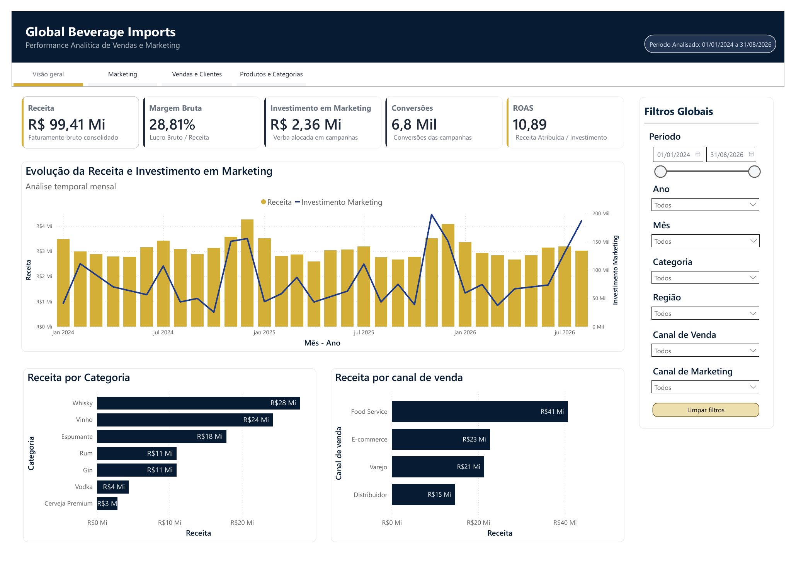
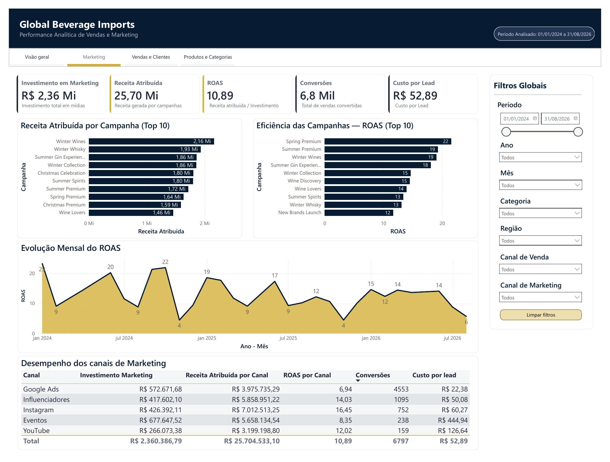
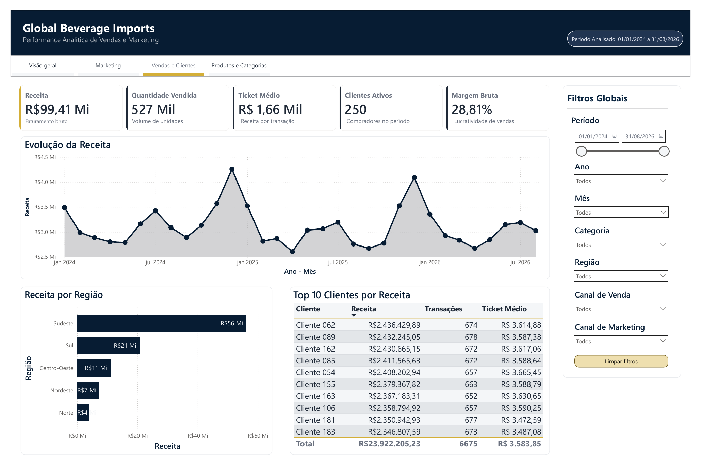
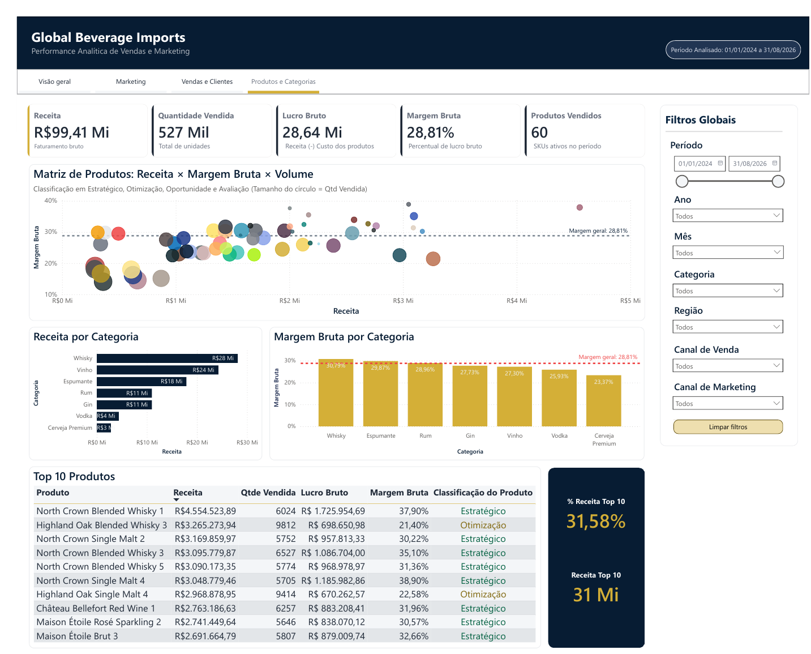

# 📊 Performance de Vendas e Marketing

Projeto de análise de dados desenvolvido para simular uma operação de vendas e marketing no segmento de bebidas, com foco em acompanhamento de desempenho, rentabilidade, eficiência de campanhas, clientes e produtos.

O projeto foi construído a partir de uma base de dados sintética gerada em Python e analisada em Power BI. Também está sendo desenvolvida uma versão web interativa em Google Apps Script.

---

## 🎯 Objetivo

Construir uma solução analítica capaz de responder perguntas como:

- Como está o desempenho geral da operação?
- Quais canais de venda geram mais receita?
- Quais campanhas e canais de marketing apresentam melhor retorno?
- Quais clientes possuem maior participação nas vendas?
- Quais produtos combinam alta receita e boa margem?
- Onde existem oportunidades de otimização?

---

## 🛠️ Tecnologias utilizadas

- Python
- Google Colab
- Power BI
- DAX
- Google Apps Script
- HTML
- CSS
- JavaScript
- Chart.js
- GitHub

---

## 📁 Estrutura do projeto

```text
performance-vendas-marketing/
│
├── power-bi/
│   ├── Performance_Vendas_Marketing.pbix
│   └── Performance_Vendas_Marketing.pdf
│
├── notebook/
│   └── geracao_base_dados.ipynb
│
├── web-app/
│   ├── Code.gs
│   ├── Index.html
│   ├── Data.html
│   ├── Charts.html
│   ├── Components.html
│   ├── Scripts.html
│   └── README.md
│
└── README.md
```

---

## 📈 Dashboard Power BI

O dashboard foi desenvolvido em quatro páginas analíticas, cada uma direcionada a uma perspectiva do negócio.

### 1. Visão Geral

Visão consolidada dos principais indicadores da operação, permitindo acompanhar receita, margem, investimento em marketing, conversões e ROAS.



### 2. Marketing

Análise do desempenho das campanhas e da eficiência dos canais de marketing, considerando investimento, receita atribuída, ROAS, conversões e custo por lead.



### 3. Vendas e Clientes

Análise do desempenho comercial, evolução da receita, distribuição geográfica das vendas e principais clientes.



### 4. Produtos e Categorias

Análise do portfólio considerando receita, volume e rentabilidade, incluindo uma matriz para classificação dos produtos em Estratégico, Otimização, Oportunidade e Avaliação.



--

## 🔎 Principais Insights

A análise dos dados permitiu identificar alguns pontos relevantes sobre o desempenho da operação:

###  Whisky lidera o faturamento

A categoria **Whisky** apresentou aproximadamente **R$ 28,1 milhões em receita**, sendo a categoria de maior faturamento. Além disso, sua margem bruta de **30,79%** ficou acima da margem geral da operação, de **28,81%**.

### Food Service é o principal canal de vendas

O canal **Food Service** concentrou aproximadamente **R$ 41 milhões em receita**, apresentando o maior faturamento entre os canais analisados.

### Instagram apresenta a maior eficiência de marketing

Entre os canais de marketing, o **Instagram apresentou o maior ROAS, de 16,45**, com aproximadamente **R$ 7,0 milhões em receita atribuída** para cerca de **R$ 426 mil investidos**.

Isso indica maior eficiência na geração de receita atribuída por real investido entre os canais analisados.

### Existe concentração relevante nos produtos líderes

Os **10 produtos de maior receita representam 31,58% do faturamento total**, equivalente a aproximadamente **R$ 31 milhões**.

Entre esses produtos, **8 foram classificados como Estratégicos**, combinando alto faturamento e margem acima da referência, enquanto **2 foram classificados como Otimização**, por apresentarem alto faturamento, mas margem inferior.

### Categorias com oportunidade de investigação

Apesar do alto faturamento, **Vinho apresenta margem bruta de 27,30%**, abaixo da margem geral de 28,81%.

Já **Cerveja Premium apresenta a menor margem entre as categorias, com 23,37%**, indicando um ponto de atenção para análises de preço, custos e composição do portfólio.

---

## 🌐 Aplicação Web

Além da versão em Power BI, está sendo desenvolvida uma versão web interativa utilizando Google Apps Script.

A aplicação possui:

- KPIs dinâmicos
- Filtros interativos
- Gráficos com Chart.js
- Tabelas detalhadas
- Navegação entre as quatro áreas analíticas

### Status

🚧 **Em desenvolvimento**

A estrutura principal já está funcional. Atualmente o projeto está na etapa de refinamento visual, validação e preparação da versão final.

---

## 🐍 Geração dos Dados

Os dados utilizados no projeto são sintéticos e foram gerados em Python.

O notebook contém etapas de:

- Criação das dimensões
- Geração das tabelas fato
- Simulação de vendas
- Simulação de campanhas de marketing
- Validação dos dados
- Exportação para análise

---

## 📝 Observações

Este projeto utiliza **dados fictícios** e foi desenvolvido exclusivamente para fins de estudo e portfólio.

A **Receita Atribuída** representa apenas vendas associadas às campanhas segundo a regra de atribuição definida na base sintética.

O **ROAS** é calculado como:

**Receita Atribuída ÷ Investimento em Marketing**

e não deve ser interpretado como ROI.

---

## 👩‍💻 Autora

**Fernanda**
